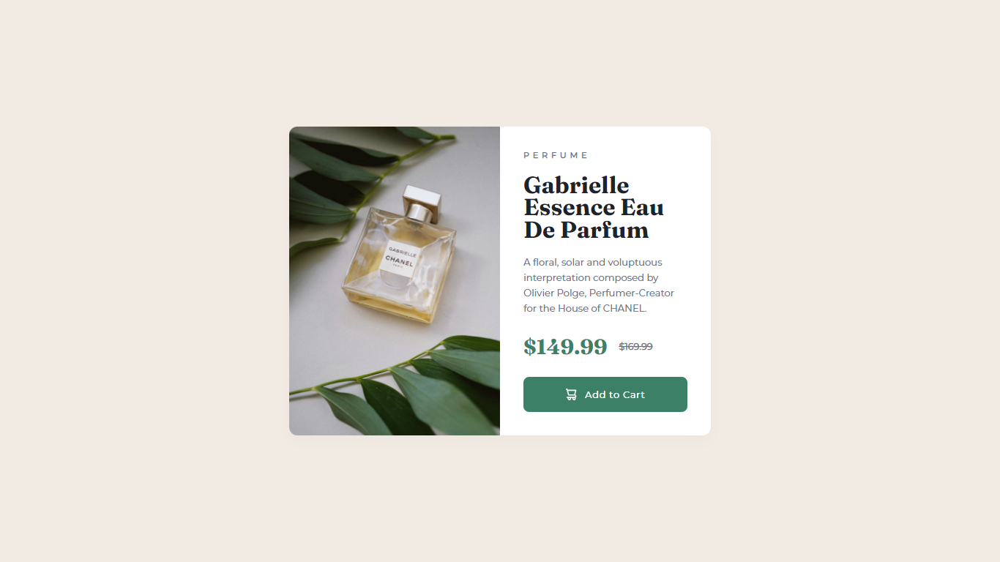
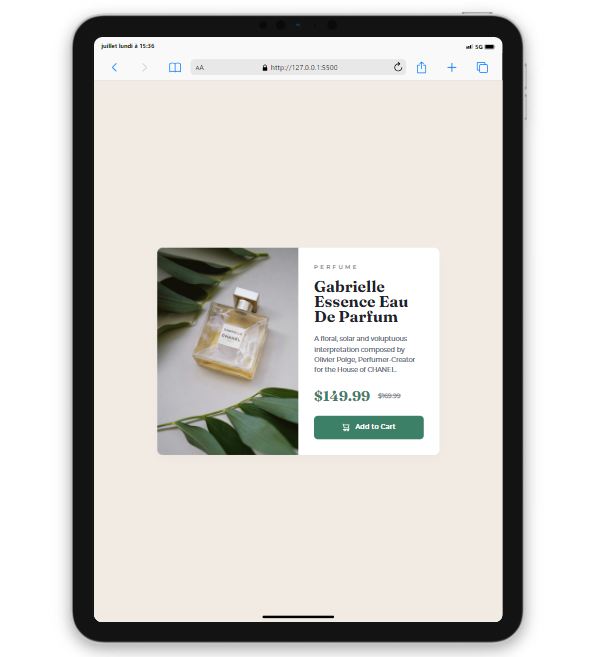
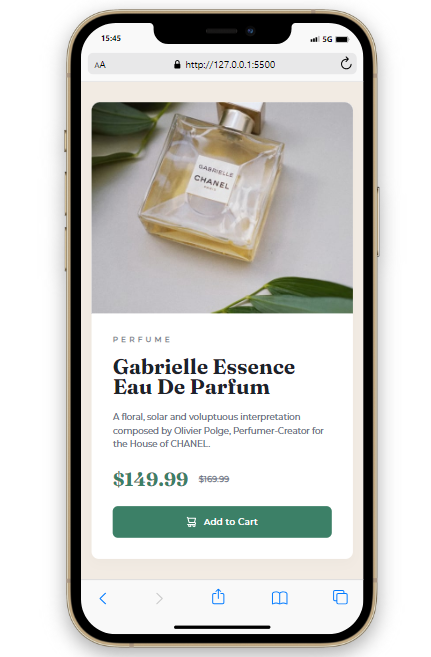

# Frontend Mentor - Product preview card component solution

This is a solution to the [Product preview card component challenge on Frontend Mentor](https://www.frontendmentor.io/challenges/product-preview-card-component-GO7UmttRfa). Frontend Mentor challenges help you improve your coding skills by building realistic projects. 

## Table of contents

- [Frontend Mentor - Product preview card component solution](#frontend-mentor---product-preview-card-component-solution)
  - [Table of contents](#table-of-contents)
  - [Overview](#overview)
    - [The challenge](#the-challenge)
    - [Screenshots](#screenshots)
    - [Links](#links)
  - [My process](#my-process)
    - [Built with](#built-with)
  - [Author](#author)

## Overview

### The challenge

Users should be able to:

- View the optimal layout depending on their device's screen size
- See hover and focus states for interactive elements

### Screenshots

### Links

- Solution URL: [My frontend mentor Solution](https://www.frontendmentor.io/solutions/product-preview-card-component-NaWBrUckBx)
- Live Site URL: [Product preview card - Fanantenana Emmanuel](https://manu3609.github.io/Product-preview-card-component/)

## My process

### Built with

- Semantic HTML5 markup
- CSS custom properties
- Flexbox

## Author

- Github - [Fanantenana Emmanuel](https://github.com/Manu3609/)
- Frontend Mentor - [@yourusername](https://www.frontendmentor.io/profile/Manu3609)
- Instagram - [@manustxrk](https://www.instagram.com/manustxrk/)
